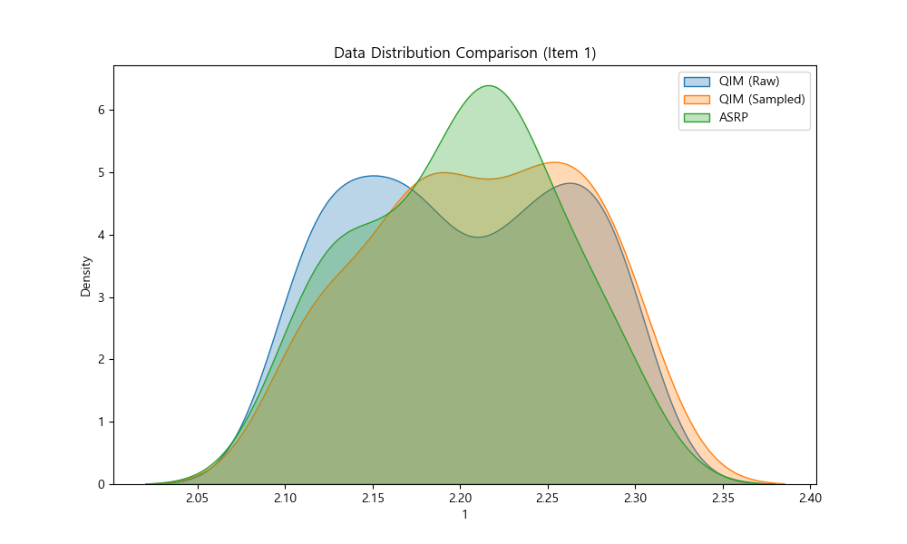
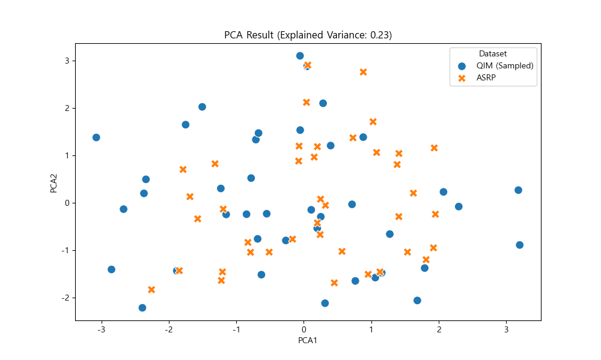
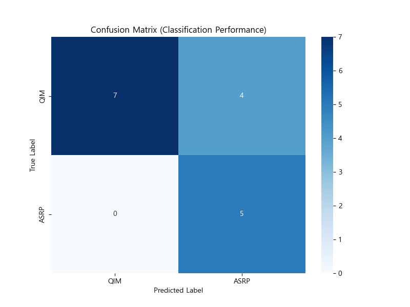

# 신뢰도 분석 결과 보고서

## 1. 데이터 개요
- **전체 데이터 수**: 150건
- **QIM (초기) 데이터**: 110건
- **ASRP (운용) 데이터**: 40건

## 2. 분석 방법
1. **샘플링**: ASRP 데이터의 분포와 유사하도록 QIM 데이터를 샘플링하여 40건을 추출했습니다. 이는 초기 상태와 운용 상태를 공정하게 비교하기 위함입니다.
2. **차원 축소 (PCA)**: 27개의 측정 항목을 2개의 주성분으로 축소하여 시각화했습니다.
3. **분류 모델**: Random Forest를 사용하여 데이터가 초기 상태(QIM)인지 노후 상태(ASRP)인지 분류했습니다.

## 3. 분석 결과

### A. 데이터 분포 비교

*   위 그래프는 측정 항목 '1'에 대한 분포를 보여줍니다.
*   **QIM (Raw)**: 전체 초기 데이터의 분포입니다.
*   **ASRP**: 운용 데이터의 분포입니다.
*   **QIM (Sampled)**: ASRP와 비교를 위해 선택된 초기 데이터입니다. 샘플링된 데이터가 ASRP와 얼마나 유사한 분포를 보이는지 확인할 수 있습니다.

### B. PCA 시각화

*   데이터를 2차원으로 축소하여 시각화한 결과입니다.
*   두 그룹(QIM, ASRP)이 명확하게 분리된다면, 운용 기간에 따른 장비의 특성 변화가 뚜렷하다는 것을 의미합니다.
*   반대로 섞여 있다면, 큰 변화가 없거나 현재 측정 항목으로는 변화를 감지하기 어렵다는 뜻일 수 있습니다.

### C. 분류 모델 성능
*   **정확도 (Accuracy)**: 0.7500
*   **상세 리포트**:
```
              precision    recall  f1-score   support

           0       1.00      0.64      0.78        11
           1       0.56      1.00      0.71         5

    accuracy                           0.75        16
   macro avg       0.78      0.82      0.75        16
weighted avg       0.86      0.75      0.76        16

```

### D. 혼동 행렬 (Confusion Matrix)

*   모델이 실제로 QIM과 ASRP를 얼마나 잘 구분했는지 보여줍니다.
*   대각선 값이 클수록 예측이 정확함을 의미합니다.

## 4. 결론
이 분석을 통해 장비가 운용 기간(약 10년) 동안 특성이 어떻게 변화했는지 통계적으로 확인할 수 있습니다. 분류 정확도가 높다면 장비의 노후화가 뚜렷하게 진행되었음을 시사합니다.
