# 신뢰도 분석 종합 리포트

## 1. 전수 스크리닝 (Full Screening)
전체 27개 측정 항목에 대해 변화율(Slope)과 변동성(Variance)을 분석하여 위험 순위를 도출했습니다.

### 1.1 위험 순위 Top 10 (Risk Ranking)
|   Item |        Slope |   Abs_Slope |          R2 |   Var_Ratio |
|-------:|-------------:|------------:|------------:|------------:|
|      6 | -0.373363    | 0.373363    | 0.0134184   |    1.29899  |
|      3 |  0.330344    | 0.330344    | 0.00762836  |    0.917965 |
|      7 | -0.255948    | 0.255948    | 0.00689663  |    0.68806  |
|      5 |  0.0107486   | 0.0107486   | 0.002584    |    1.08979  |
|      4 |  0.00244978  | 0.00244978  | 0.000453829 |    0.946248 |
|     23 |  0.00208639  | 0.00208639  | 0.0244164   |    1.22107  |
|     27 |  0.0010973   | 0.0010973   | 0.00353505  |    0.50652  |
|     20 | -0.000434948 | 0.000434948 | 0.00601159  |    1.13526  |
|     24 | -0.000424639 | 0.000424639 | 0.0237341   |    1.07832  |
|     21 |  0.000180206 | 0.000180206 | 0.00174626  |    0.824546 |

### 1.2 위험도 시각화
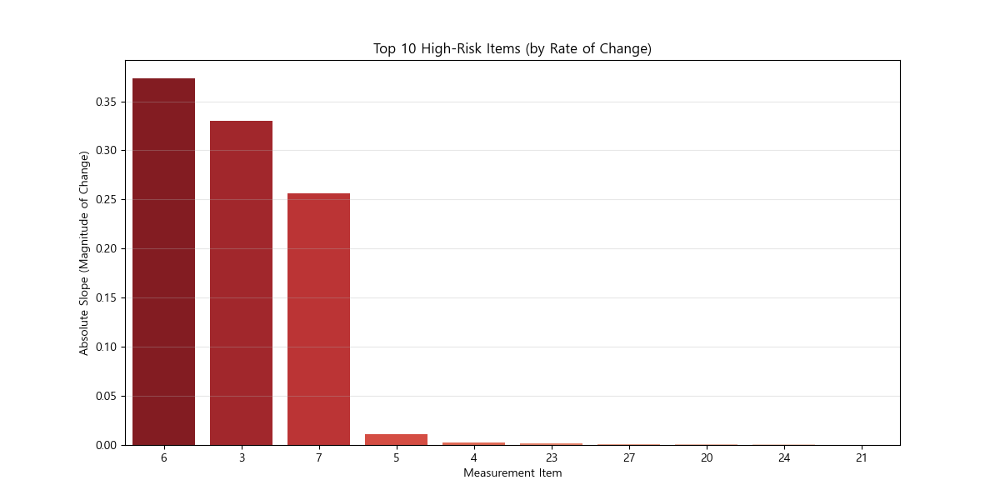

## 2. Top-5 항목 정밀 분석
위험도가 가장 높은 상위 5개 항목에 대한 심층 분석 결과입니다.

## [Item 6] 상세 분석

### 1. 데이터 분포 (Distribution)
*   **KS 통계량**: 0.2409
*   **JSD (유사도)**: 0.3744

| 분포 비교 (KDE) | 데이터 개요 (Box) |
| :---: | :---: |
|  | 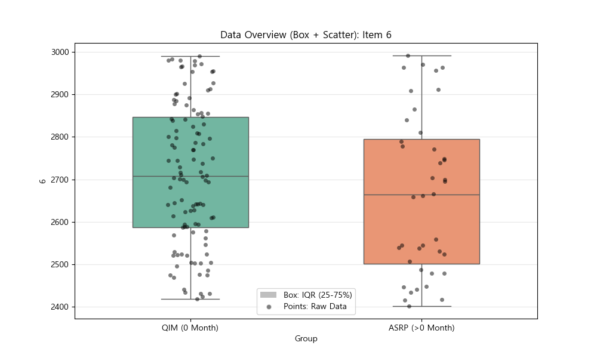 |

### 2. 추세 예측 (Trend Prediction)
*   **예측 범위**: 20년 (240개월)
*   **신뢰 구간**: 90%

| 다중 모델 예측 | 개별 매칭 경로 |
| :---: | :---: |
|  | 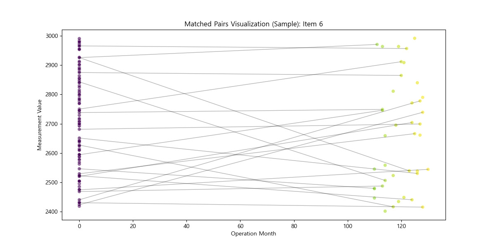 |

---

## [Item 3] 상세 분석

### 1. 데이터 분포 (Distribution)
*   **KS 통계량**: 0.1386
*   **JSD (유사도)**: 0.2436

| 분포 비교 (KDE) | 데이터 개요 (Box) |
| :---: | :---: |
| 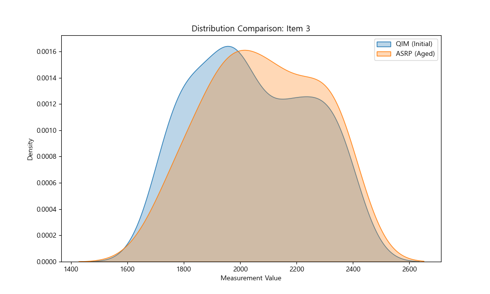 | 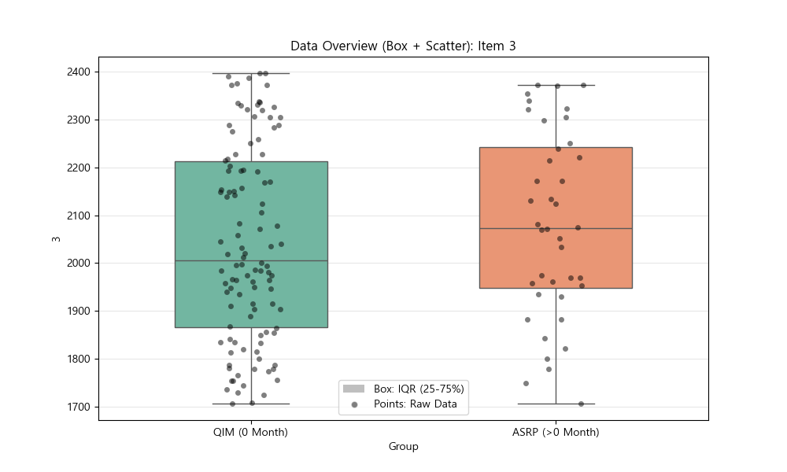 |

### 2. 추세 예측 (Trend Prediction)
*   **예측 범위**: 20년 (240개월)
*   **신뢰 구간**: 90%

| 다중 모델 예측 | 개별 매칭 경로 |
| :---: | :---: |
|  | 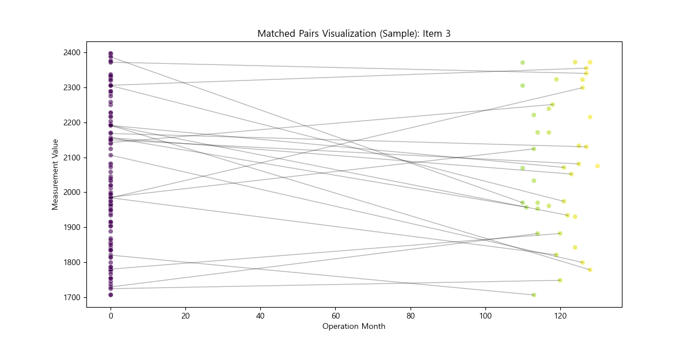 |

---

## [Item 7] 상세 분석

### 1. 데이터 분포 (Distribution)
*   **KS 통계량**: 0.2477
*   **JSD (유사도)**: 0.4115

| 분포 비교 (KDE) | 데이터 개요 (Box) |
| :---: | :---: |
|  | 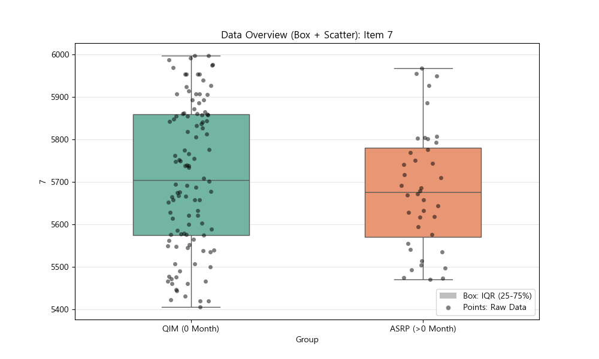 |

### 2. 추세 예측 (Trend Prediction)
*   **예측 범위**: 20년 (240개월)
*   **신뢰 구간**: 90%

| 다중 모델 예측 | 개별 매칭 경로 |
| :---: | :---: |
|  | 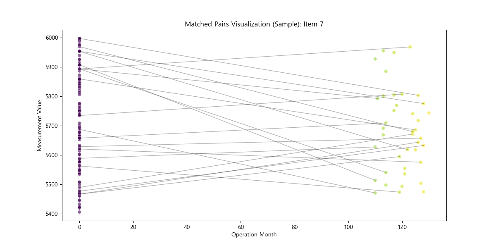 |

---

## [Item 5] 상세 분석

### 1. 데이터 분포 (Distribution)
*   **KS 통계량**: 0.1023
*   **JSD (유사도)**: 0.2147

| 분포 비교 (KDE) | 데이터 개요 (Box) |
| :---: | :---: |
|  | 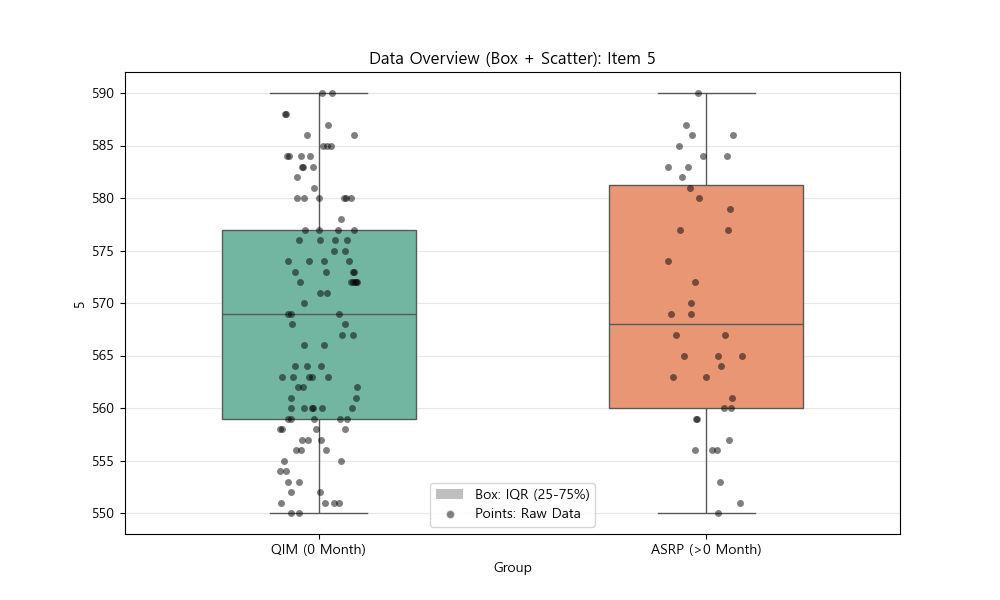 |

### 2. 추세 예측 (Trend Prediction)
*   **예측 범위**: 20년 (240개월)
*   **신뢰 구간**: 90%

| 다중 모델 예측 | 개별 매칭 경로 |
| :---: | :---: |
|  | 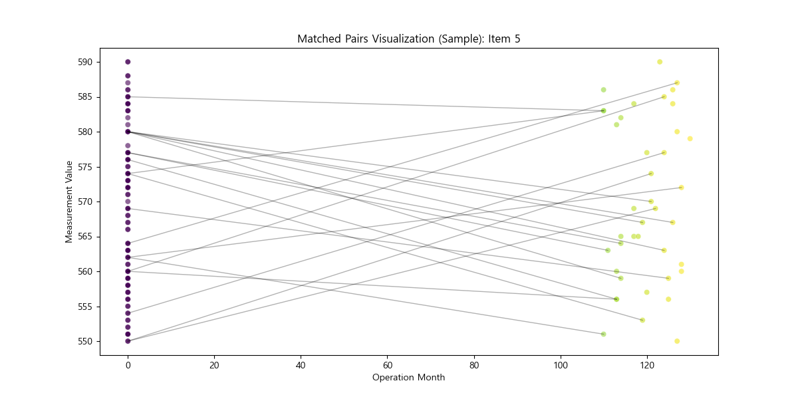 |

---

## [Item 4] 상세 분석

### 1. 데이터 분포 (Distribution)
*   **KS 통계량**: 0.1023
*   **JSD (유사도)**: 0.3465

| 분포 비교 (KDE) | 데이터 개요 (Box) |
| :---: | :---: |
|  | 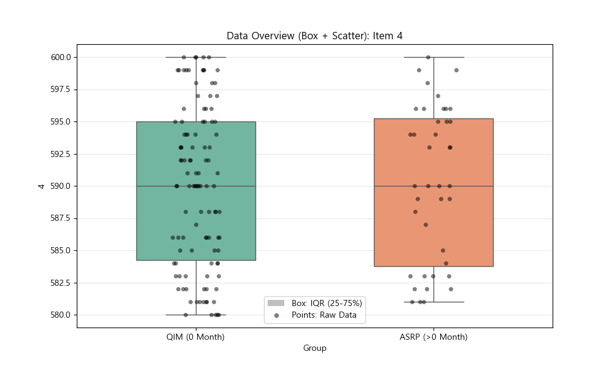 |

### 2. 추세 예측 (Trend Prediction)
*   **예측 범위**: 20년 (240개월)
*   **신뢰 구간**: 90%

| 다중 모델 예측 | 개별 매칭 경로 |
| :---: | :---: |
|  | 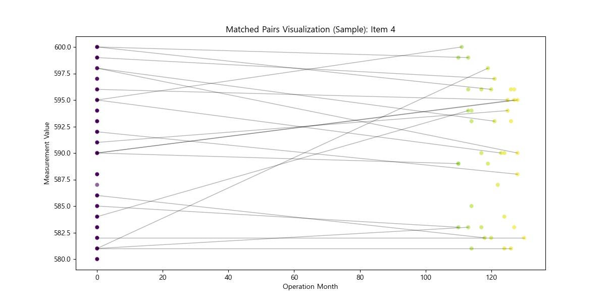 |

---

## 3. 결론
상기 분석을 통해 장비의 주요 노후화 인자를 식별하고, 미래 수명을 예측할 수 있습니다.
