# 신뢰도 분석 종합 리포트 (v1)

## 1. 전수 스크리닝 (Full Screening)
전체 27개 측정 항목에 대해 변화율(Slope)과 변동성(Variance)을 분석하여 위험 순위를 도출했습니다.

### 1.1 위험 순위 Top 10 (Risk Ranking)
|   Item |       Slope |   Abs_Slope |   Norm_Slope |   Spec_Range |         R2 |   Var_Ratio |
|-------:|------------:|------------:|-------------:|-------------:|-----------:|------------:|
|     23 | -0.0513039  |  0.0513039  |    0.32065   |           16 | 0.573971   |    2.22009  |
|     24 | -0.036749   |  0.036749   |    0.229681  |           16 | 0.394092   |    2.12897  |
|     25 | -0.031265   |  0.031265   |    0.195406  |           16 | 0.328537   |    2.20814  |
|     26 | -0.0172031  |  0.0172031  |    0.107519  |           16 | 0.131143   |    2.41617  |
|     27 | -0.00932325 |  0.00932325 |    0.0582703 |           16 | 0.042559   |    2.32558  |
|     22 | -0.00486687 |  0.00486687 |    0.030418  |           16 | 0.0176153  |    1.10932  |
|      4 | -0.00240059 |  0.00240059 |    0.0150037 |           16 | 0.00500457 |    0.825389 |
|      8 |  0.0021272  |  0.0021272  |    0.013295  |           16 | 0.0034627  |    0.742129 |
|      3 |  0.00201001 |  0.00201001 |    0.0125626 |           16 | 0.00368168 |    1.07795  |
|     21 |  0.00166199 |  0.00166199 |    0.0103875 |           16 | 0.0026197  |    0.726446 |

### 1.2 위험도 시각화
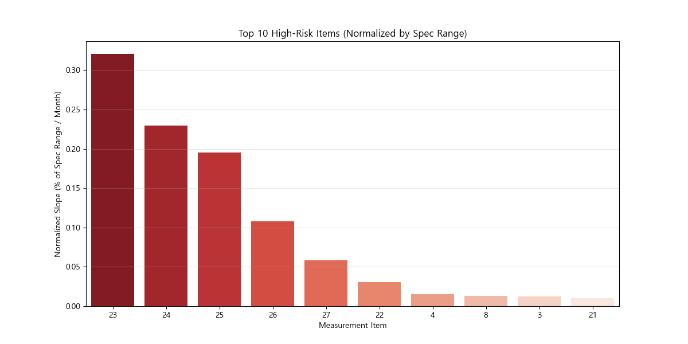

## 2. Top-5 항목 정밀 분석
위험도가 가장 높은 상위 5개 항목에 대한 심층 분석 결과입니다.

## [Item 23] 상세 분석

### 1. 데이터 분포 (Distribution)
*   **KS 통계량**: 0.7960
*   **JSD (유사도)**: 0.6486

| 분포 비교 (KDE) | 데이터 개요 (Box) |
| :---: | :---: |
| 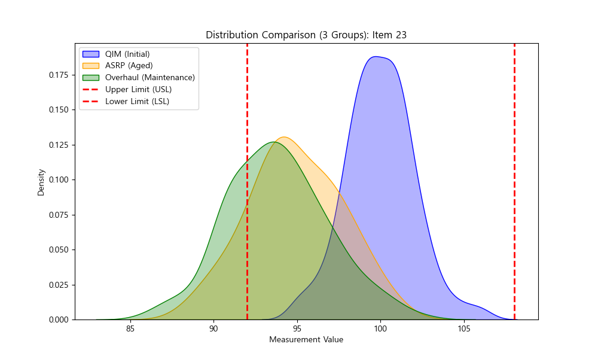 | 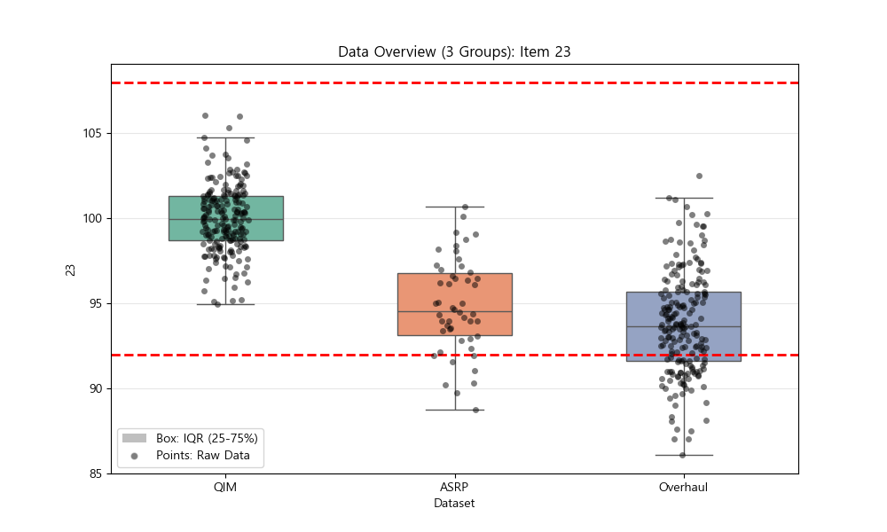 |

### 2. 추세 예측 및 모델 성능 (Trend & Performance)
*   **예측 범위**: 20년 (240개월)
*   **신뢰 구간**: 90%
*   **최적 모델**: **Polynomial** (RMSE: 2.5707)

| 다중 모델 예측 | 모델 성능 비교 (RMSE) |
| :---: | :---: |
| 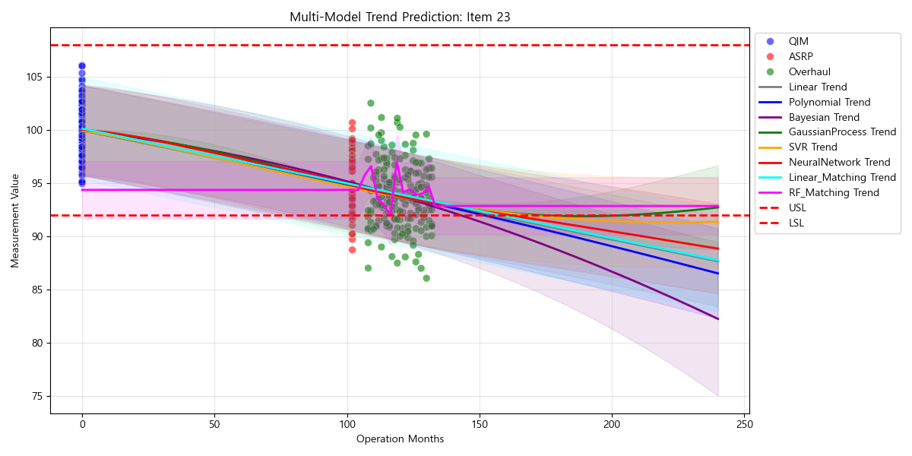 | 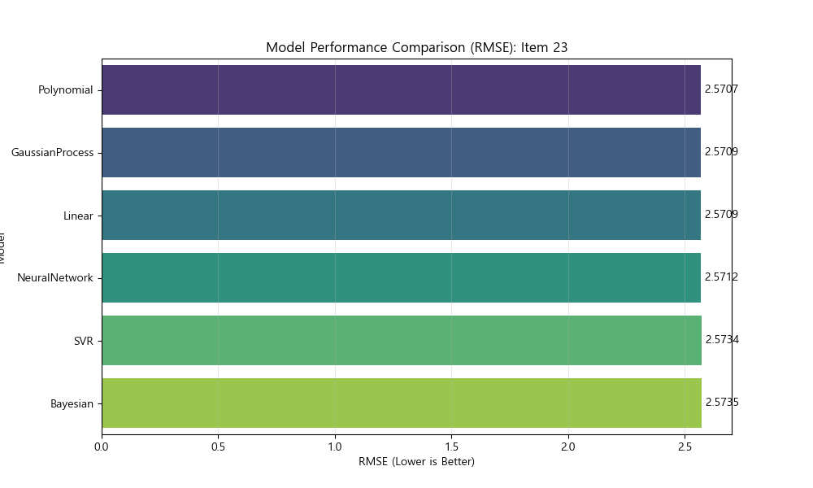 |

**모델별 RMSE (낮을수록 좋음)**
| 모델 | RMSE |
| :--- | :--- |
| Polynomial | 2.5707 |
| GaussianProcess | 2.5709 |
| Linear | 2.5709 |
| NeuralNetwork | 2.5712 |
| SVR | 2.5734 |
| Bayesian | 2.5735 |

### 3. 개별 매칭 경로
| 개별 매칭 경로 |
| :---: |
| 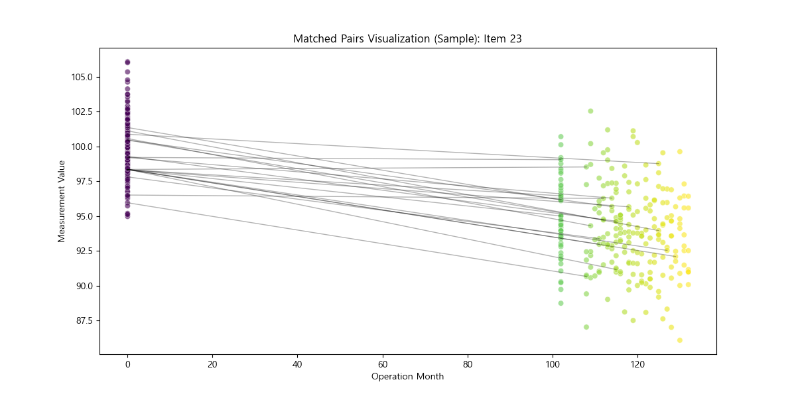 |

---

## [Item 24] 상세 분석

### 1. 데이터 분포 (Distribution)
*   **KS 통계량**: 0.6440
*   **JSD (유사도)**: 0.5268

| 분포 비교 (KDE) | 데이터 개요 (Box) |
| :---: | :---: |
| 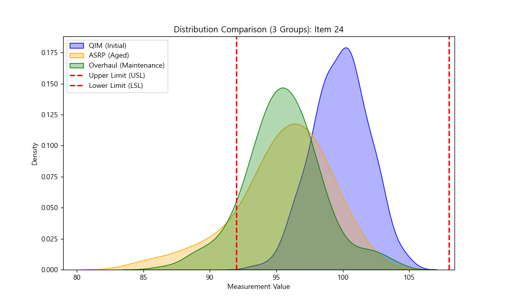 | 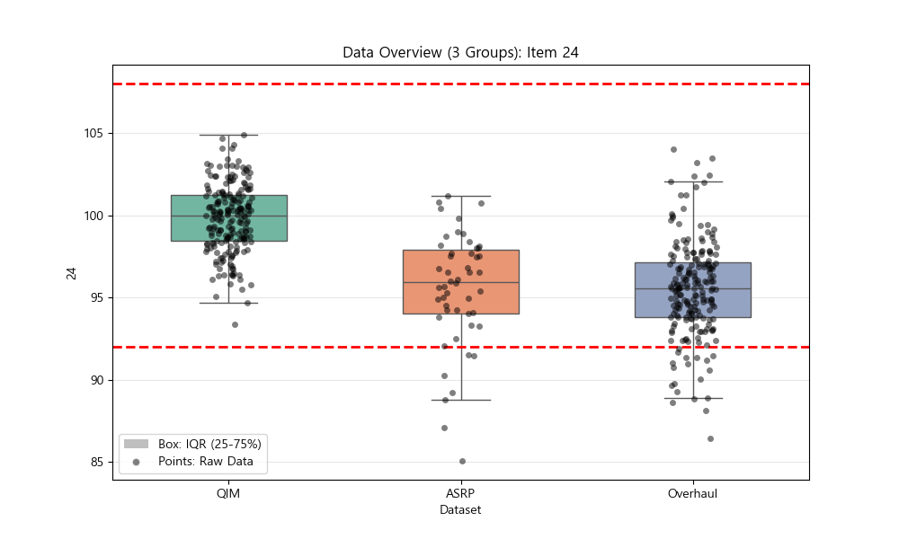 |

### 2. 추세 예측 및 모델 성능 (Trend & Performance)
*   **예측 범위**: 20년 (240개월)
*   **신뢰 구간**: 90%
*   **최적 모델**: **GaussianProcess** (RMSE: 2.5902)

| 다중 모델 예측 | 모델 성능 비교 (RMSE) |
| :---: | :---: |
| 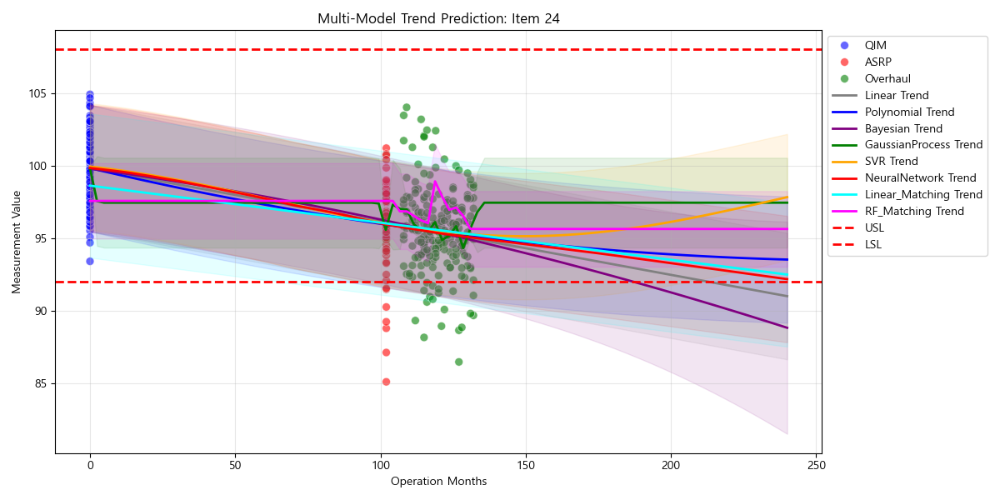 | 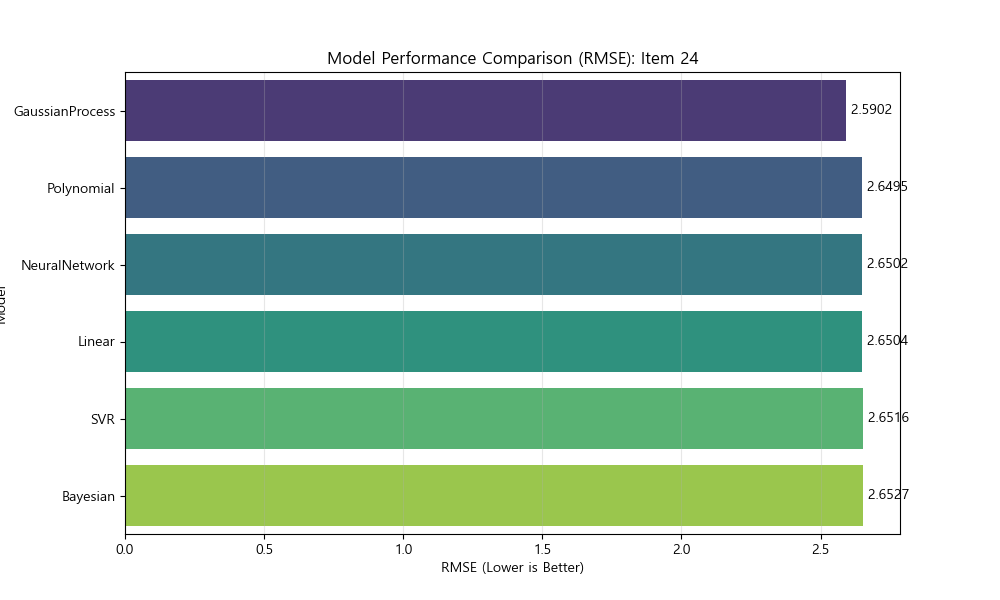 |

**모델별 RMSE (낮을수록 좋음)**
| 모델 | RMSE |
| :--- | :--- |
| GaussianProcess | 2.5902 |
| Polynomial | 2.6495 |
| NeuralNetwork | 2.6502 |
| Linear | 2.6504 |
| SVR | 2.6516 |
| Bayesian | 2.6527 |

### 3. 개별 매칭 경로
| 개별 매칭 경로 |
| :---: |
| 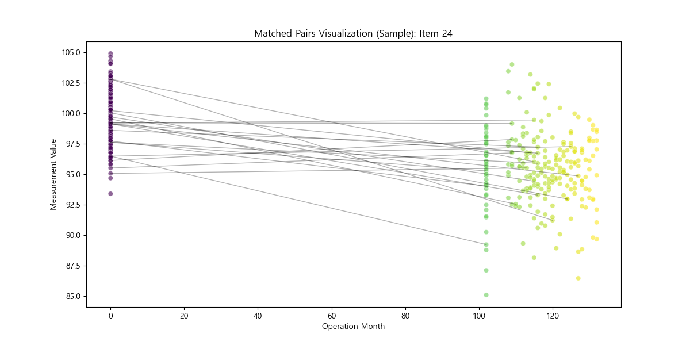 |

---

## [Item 25] 상세 분석

### 1. 데이터 분포 (Distribution)
*   **KS 통계량**: 0.5720
*   **JSD (유사도)**: 0.4790

| 분포 비교 (KDE) | 데이터 개요 (Box) |
| :---: | :---: |
| 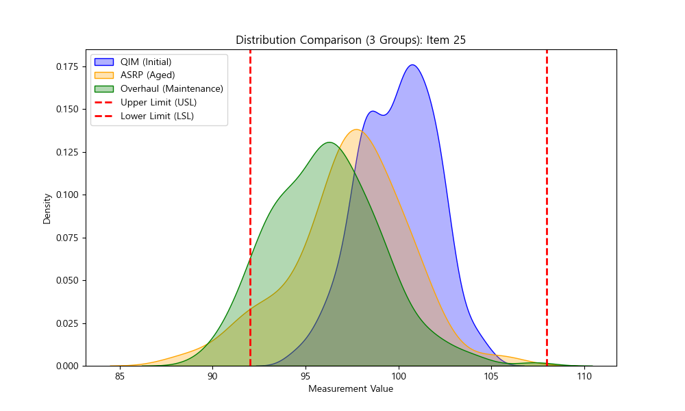 | 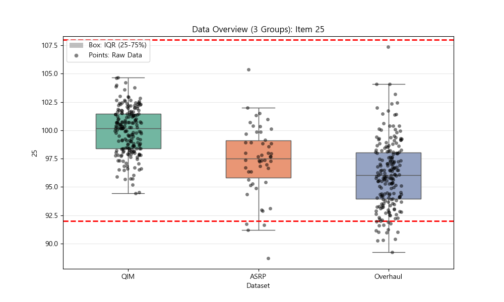 |

### 2. 추세 예측 및 모델 성능 (Trend & Performance)
*   **예측 범위**: 20년 (240개월)
*   **신뢰 구간**: 90%
*   **최적 모델**: **GaussianProcess** (RMSE: 2.4770)

| 다중 모델 예측 | 모델 성능 비교 (RMSE) |
| :---: | :---: |
| 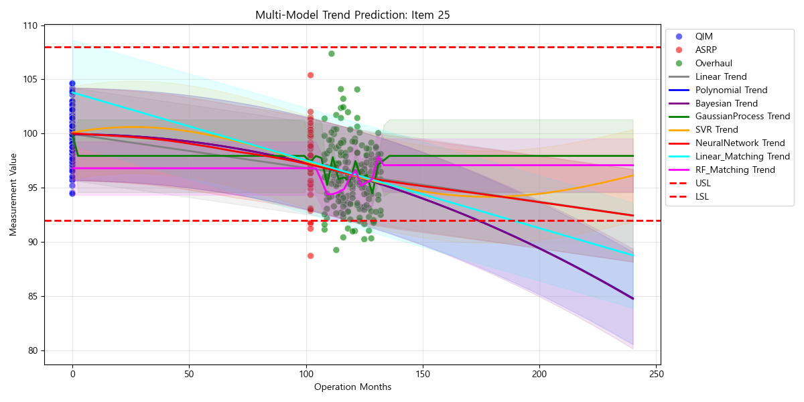 |  |

**모델별 RMSE (낮을수록 좋음)**
| 모델 | RMSE |
| :--- | :--- |
| GaussianProcess | 2.4770 |
| Polynomial | 2.5913 |
| Bayesian | 2.5913 |
| NeuralNetwork | 2.5928 |
| SVR | 2.5932 |
| Linear | 2.5998 |

### 3. 개별 매칭 경로
| 개별 매칭 경로 |
| :---: |
| 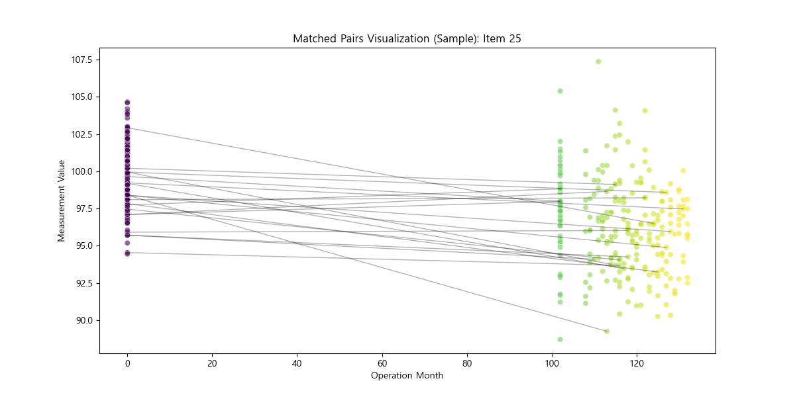 |

---

## [Item 26] 상세 분석

### 1. 데이터 분포 (Distribution)
*   **KS 통계량**: 0.3600
*   **JSD (유사도)**: 0.3458

| 분포 비교 (KDE) | 데이터 개요 (Box) |
| :---: | :---: |
| 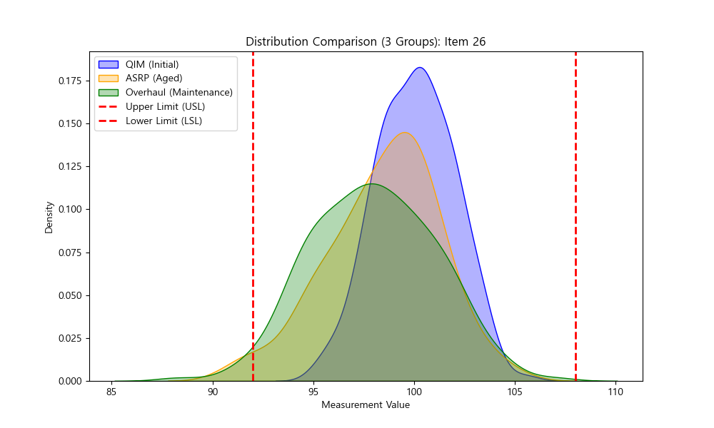 | 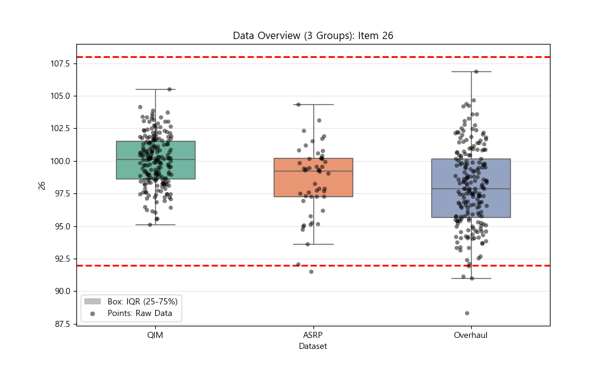 |

### 2. 추세 예측 및 모델 성능 (Trend & Performance)
*   **예측 범위**: 20년 (240개월)
*   **신뢰 구간**: 90%
*   **최적 모델**: **GaussianProcess** (RMSE: 2.4293)

| 다중 모델 예측 | 모델 성능 비교 (RMSE) |
| :---: | :---: |
|  | 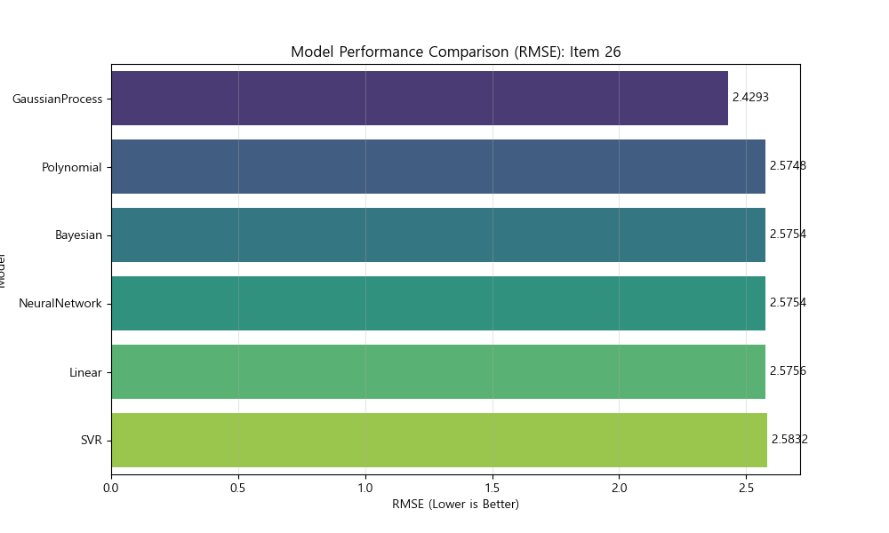 |

**모델별 RMSE (낮을수록 좋음)**
| 모델 | RMSE |
| :--- | :--- |
| GaussianProcess | 2.4293 |
| Polynomial | 2.5748 |
| Bayesian | 2.5754 |
| NeuralNetwork | 2.5754 |
| Linear | 2.5756 |
| SVR | 2.5832 |

### 3. 개별 매칭 경로
| 개별 매칭 경로 |
| :---: |
| 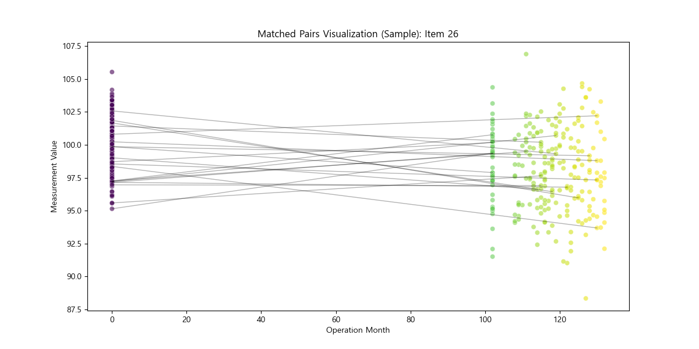 |

---

## [Item 27] 상세 분석

### 1. 데이터 분포 (Distribution)
*   **KS 통계량**: 0.2380
*   **JSD (유사도)**: 0.2699

| 분포 비교 (KDE) | 데이터 개요 (Box) |
| :---: | :---: |
|  | 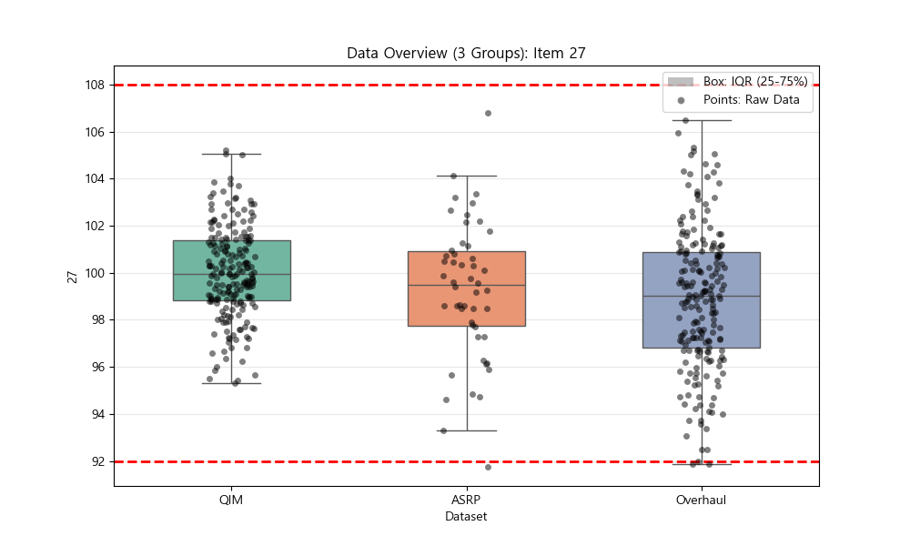 |

### 2. 추세 예측 및 모델 성능 (Trend & Performance)
*   **예측 범위**: 20년 (240개월)
*   **신뢰 구간**: 90%
*   **최적 모델**: **GaussianProcess** (RMSE: 2.4708)

| 다중 모델 예측 | 모델 성능 비교 (RMSE) |
| :---: | :---: |
| 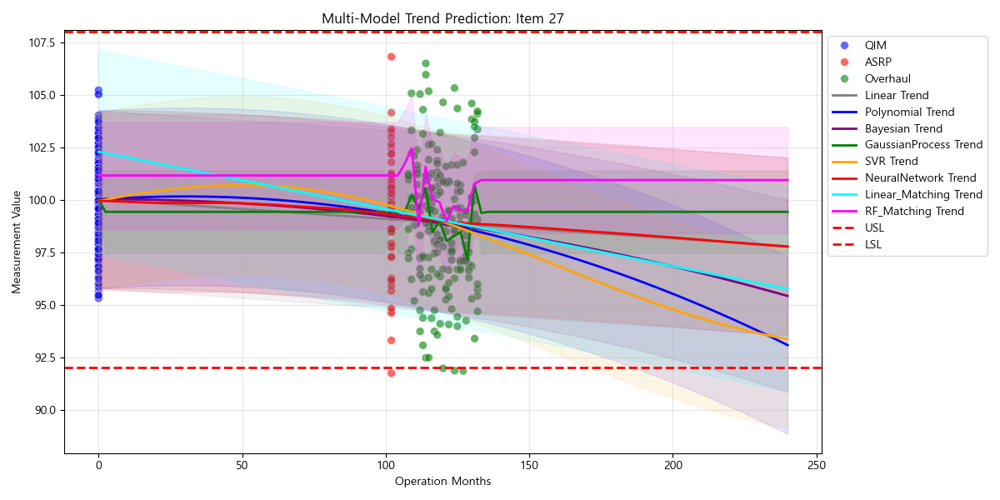 | 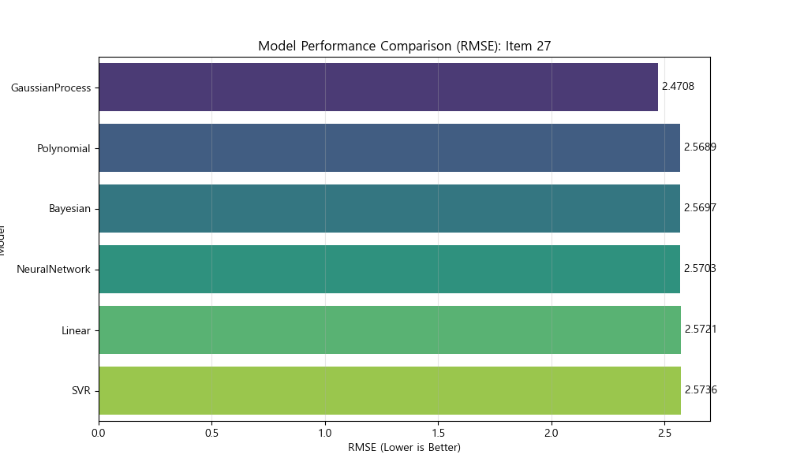 |

**모델별 RMSE (낮을수록 좋음)**
| 모델 | RMSE |
| :--- | :--- |
| GaussianProcess | 2.4708 |
| Polynomial | 2.5689 |
| Bayesian | 2.5697 |
| NeuralNetwork | 2.5703 |
| Linear | 2.5721 |
| SVR | 2.5736 |

### 3. 개별 매칭 경로
| 개별 매칭 경로 |
| :---: |
|  |

---

## 3. 결론 및 제언

### 3.1 종합 해석 (Comprehensive Interpretation)
전체 27개 항목에 대한 분석 결과, 다음과 같은 경향성이 식별되었습니다.

1.  **주요 노후화 항목**: **23, 24, 25** 항목들이 시간 경과에 따라 가장 뚜렷한 변화를 보이고 있습니다.
    *   특히 **Item 23**은(는) 월평균 **-0.0513**의 변화율을 보이며, 가장 급격한 상태 변화가 관찰됩니다.
2.  **데이터 일관성**: 상위 위험 항목들의 R-squared 값이 전반적으로 높게 나타난다면, 이는 노후화가 무작위가 아닌 **예측 가능한 패턴**으로 진행됨을 의미합니다.
3.  **관리 제언**: 상기 Top-5 항목들은 향후 고장 발생의 선행 지표가 될 가능성이 높으므로, 예방 정비 시 **중점 점검 대상**으로 관리할 것을 권장합니다.

