# 신뢰도 분석 종합 리포트 (v1)

## 1. 전수 스크리닝 (Full Screening)
전체 27개 측정 항목에 대해 변화율(Slope)과 변동성(Variance)을 분석하여 위험 순위를 도출했습니다.

### 1.1 위험 순위 Top 10 (Risk Ranking)
|   Item |       Slope |   Abs_Slope |   Norm_Slope |   Spec_Range |          R2 |     Var_Ratio |
|-------:|------------:|------------:|-------------:|-------------:|------------:|--------------:|
|     23 | -0.0334931  |  0.0334931  |    0.418664  |          8   | 0.0936775   |    947.309    |
|      1 |  0.0025857  |  0.0025857  |    0.323212  |          0.8 | 0.00276976  |   3459.26     |
|      2 |  0.0024481  |  0.0024481  |    0.306012  |          0.8 | 0.00255158  |   3039.03     |
|     25 | -0.00931838 |  0.00931838 |    0.23296   |          4   | 0.0318243   |   1008.21     |
|     10 | -0.0147058  |  0.0147058  |    0.147058  |         10   | 0.00736582  |   2291.89     |
|     22 | -0.00498648 |  0.00498648 |    0.124662  |          4   | 0.000425343 | 173323        |
|     21 | -0.00490443 |  0.00490443 |    0.122611  |          4   | 0.000399404 |  26124        |
|      9 |  0.00341855 |  0.00341855 |    0.113952  |          3   | 0.590446    |      3.36774  |
|      5 | -0.0846496  |  0.0846496  |    0.0705413 |        120   | 0.111939    |      1.16703  |
|      3 | -0.560555   |  0.560555   |    0.0400396 |       1400   | 0.0606822   |      0.261122 |

### 1.2 위험도 시각화
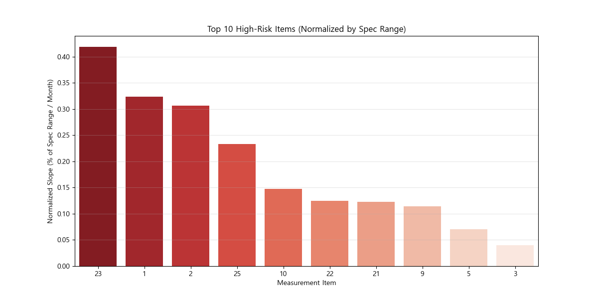

## 2. Top-5 항목 정밀 분석
위험도가 가장 높은 상위 5개 항목에 대한 심층 분석 결과입니다.

## [Item 23] 상세 분석

### 1. 데이터 분포 (Distribution)
*   **KS 통계량**: 0.4417
*   **JSD (유사도)**: 0.2626

| 분포 비교 (KDE) | 데이터 개요 (Box) |
| :---: | :---: |
| 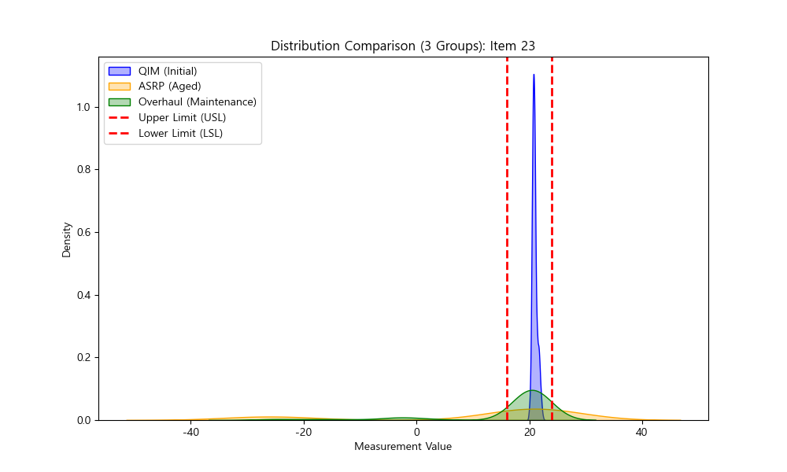 | 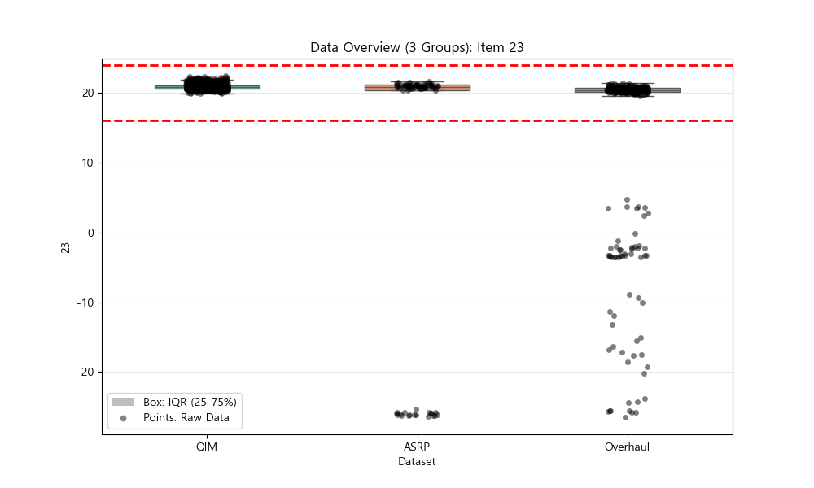 |

### 2. 추세 예측 및 모델 성능 (Trend & Performance)
*   **예측 범위**: 20년 (240개월)
*   **신뢰 구간**: 90%
*   **최적 모델**: **GaussianProcess** (RMSE: 6.6323)

| 다중 모델 예측 | 모델 성능 비교 (RMSE) |
| :---: | :---: |
| 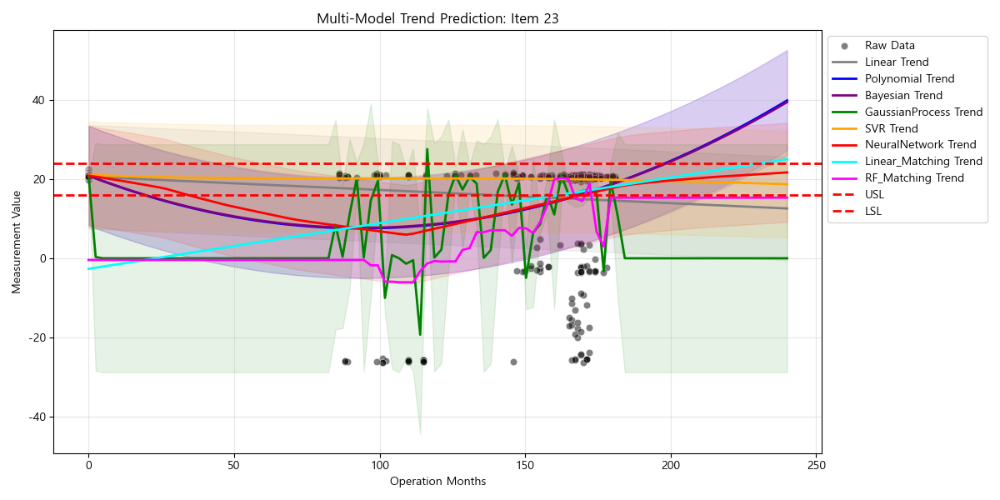 |  |

**모델별 RMSE (낮을수록 좋음)**
| 모델 | RMSE |
| :--- | :--- |
| GaussianProcess | 6.6323 |
| NeuralNetwork | 7.6146 |
| Polynomial | 7.6533 |
| Bayesian | 7.6534 |
| Linear | 7.9656 |
| SVR | 8.4313 |

### 3. 개별 매칭 경로
| 개별 매칭 경로 |
| :---: |
| 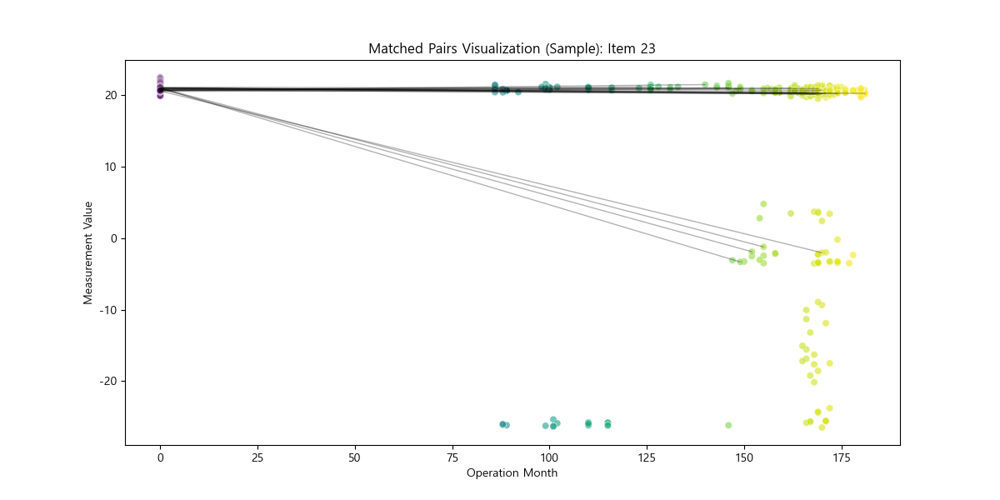 |

---

## [Item 1] 상세 분석

### 1. 데이터 분포 (Distribution)
*   **KS 통계량**: 0.5984
*   **JSD (유사도)**: 0.0752

| 분포 비교 (KDE) | 데이터 개요 (Box) |
| :---: | :---: |
| 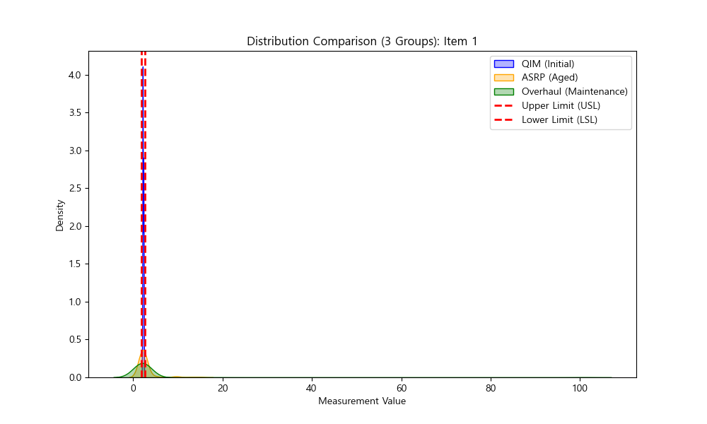 |  |

### 2. 추세 예측 및 모델 성능 (Trend & Performance)
*   **예측 범위**: 20년 (240개월)
*   **신뢰 구간**: 90%
*   **최적 모델**: **GaussianProcess** (RMSE: 3.7336)

| 다중 모델 예측 | 모델 성능 비교 (RMSE) |
| :---: | :---: |
| 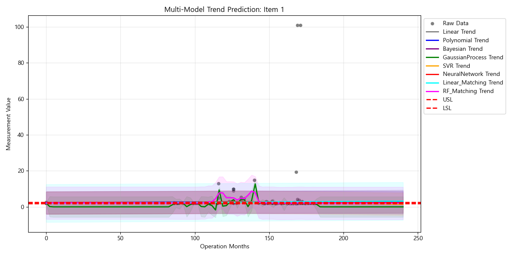 |  |

**모델별 RMSE (낮을수록 좋음)**
| 모델 | RMSE |
| :--- | :--- |
| GaussianProcess | 3.7336 |
| NeuralNetwork | 3.7936 |
| Polynomial | 3.7950 |
| Linear | 3.7952 |
| Bayesian | 3.7954 |
| SVR | 3.8018 |

### 3. 개별 매칭 경로
| 개별 매칭 경로 |
| :---: |
| 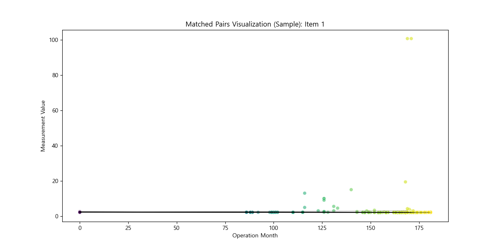 |

---

## [Item 2] 상세 분석

### 1. 데이터 분포 (Distribution)
*   **KS 통계량**: 0.5816
*   **JSD (유사도)**: 0.0460

| 분포 비교 (KDE) | 데이터 개요 (Box) |
| :---: | :---: |
| 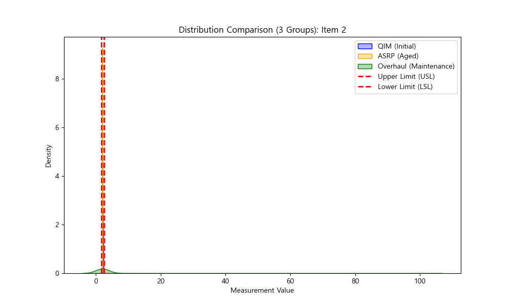 | 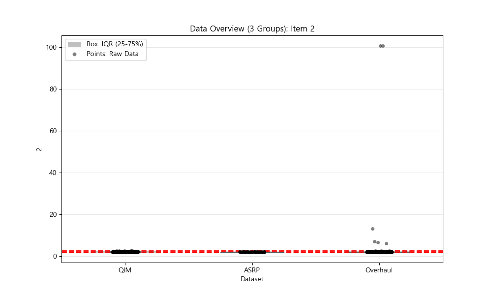 |

### 2. 추세 예측 및 모델 성능 (Trend & Performance)
*   **예측 범위**: 20년 (240개월)
*   **신뢰 구간**: 90%
*   **최적 모델**: **GaussianProcess** (RMSE: 3.6476)

| 다중 모델 예측 | 모델 성능 비교 (RMSE) |
| :---: | :---: |
| 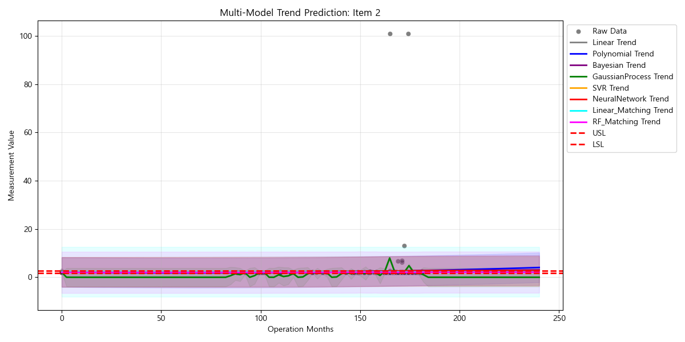 |  |

**모델별 RMSE (낮을수록 좋음)**
| 모델 | RMSE |
| :--- | :--- |
| GaussianProcess | 3.6476 |
| NeuralNetwork | 3.7424 |
| Polynomial | 3.7425 |
| Bayesian | 3.7435 |
| Linear | 3.7441 |
| SVR | 3.7461 |

### 3. 개별 매칭 경로
| 개별 매칭 경로 |
| :---: |
| 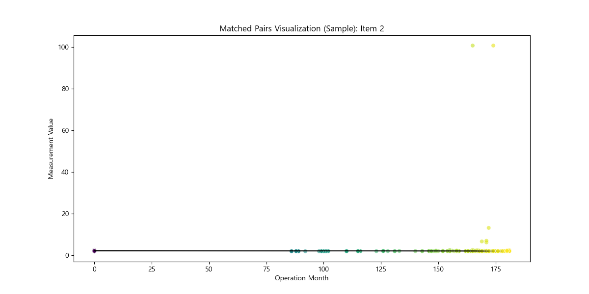 |

---

## [Item 25] 상세 분석

### 1. 데이터 분포 (Distribution)
*   **KS 통계량**: 0.2027
*   **JSD (유사도)**: 0.1698

| 분포 비교 (KDE) | 데이터 개요 (Box) |
| :---: | :---: |
|  | 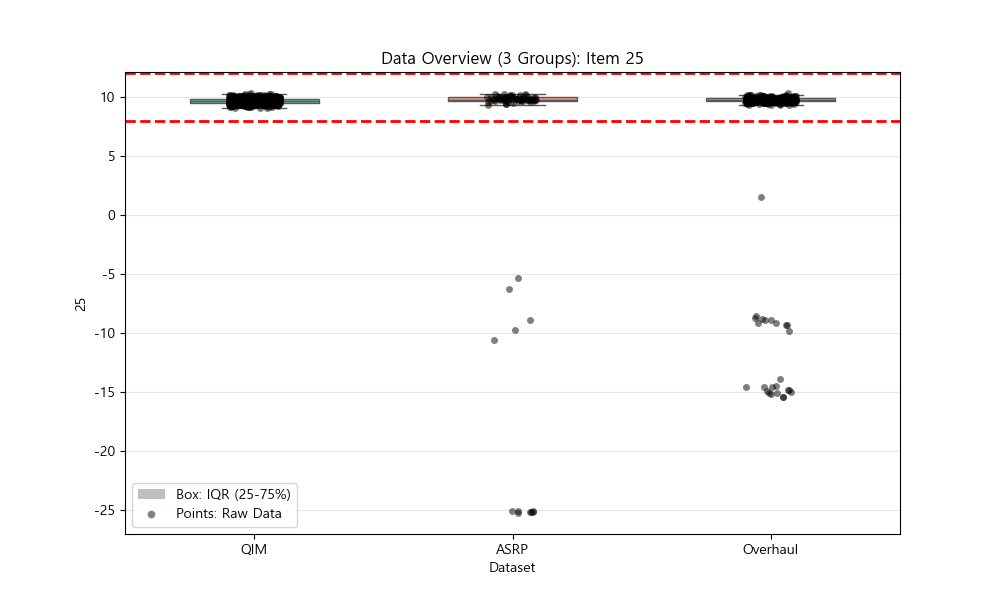 |

### 2. 추세 예측 및 모델 성능 (Trend & Performance)
*   **예측 범위**: 20년 (240개월)
*   **신뢰 구간**: 90%
*   **최적 모델**: **GaussianProcess** (RMSE: 3.4121)

| 다중 모델 예측 | 모델 성능 비교 (RMSE) |
| :---: | :---: |
| 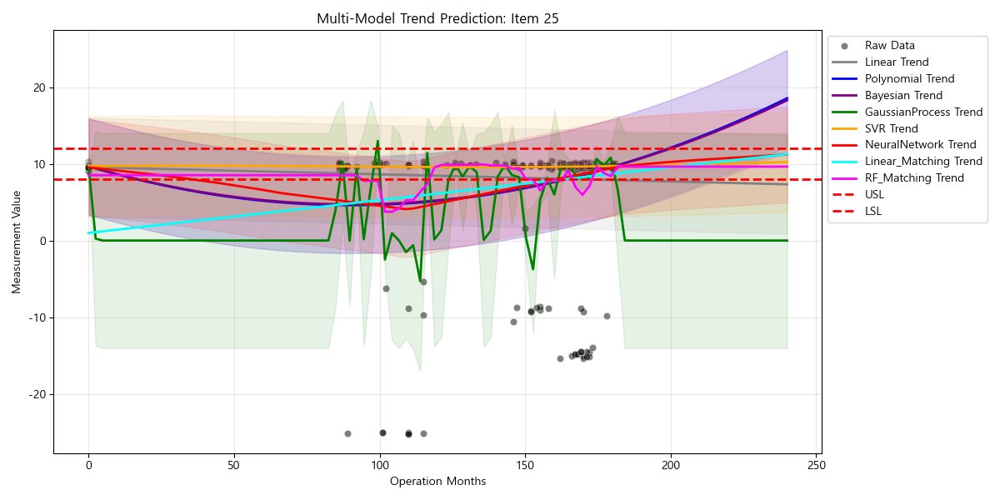 |  |

**모델별 RMSE (낮을수록 좋음)**
| 모델 | RMSE |
| :--- | :--- |
| GaussianProcess | 3.4121 |
| NeuralNetwork | 3.7963 |
| Polynomial | 3.8128 |
| Bayesian | 3.8128 |
| Linear | 3.9191 |
| SVR | 4.0222 |

### 3. 개별 매칭 경로
| 개별 매칭 경로 |
| :---: |
| 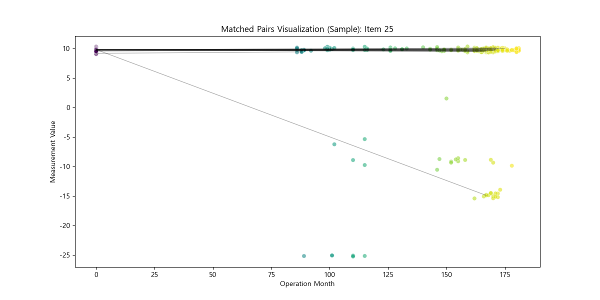 |

---

## [Item 10] 상세 분석

### 1. 데이터 분포 (Distribution)
*   **KS 통계량**: 0.1668
*   **JSD (유사도)**: 0.0660

| 분포 비교 (KDE) | 데이터 개요 (Box) |
| :---: | :---: |
|  | 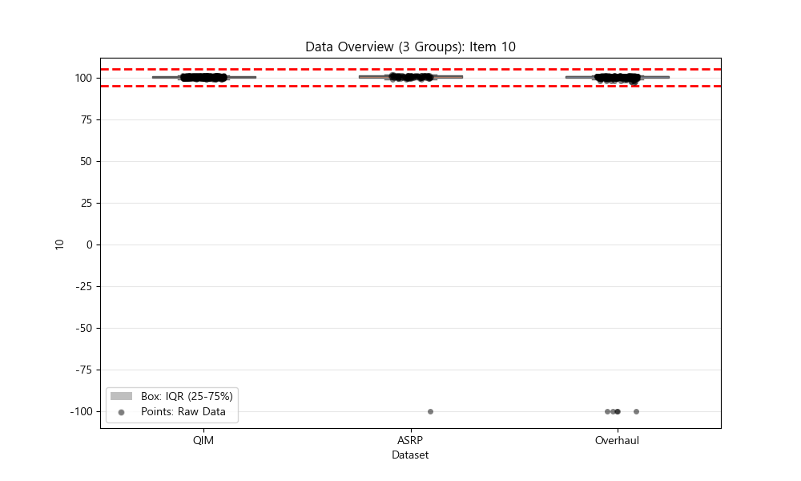 |

### 2. 추세 예측 및 모델 성능 (Trend & Performance)
*   **예측 범위**: 20년 (240개월)
*   **신뢰 구간**: 90%
*   **최적 모델**: **GaussianProcess** (RMSE: 11.9540)

| 다중 모델 예측 | 모델 성능 비교 (RMSE) |
| :---: | :---: |
| 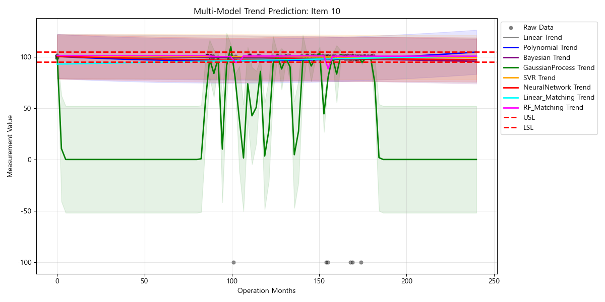 |  |

**모델별 RMSE (낮을수록 좋음)**
| 모델 | RMSE |
| :--- | :--- |
| GaussianProcess | 11.9540 |
| Polynomial | 13.1152 |
| NeuralNetwork | 13.1171 |
| Linear | 13.1306 |
| Bayesian | 13.1371 |
| SVR | 13.1778 |

### 3. 개별 매칭 경로
| 개별 매칭 경로 |
| :---: |
| 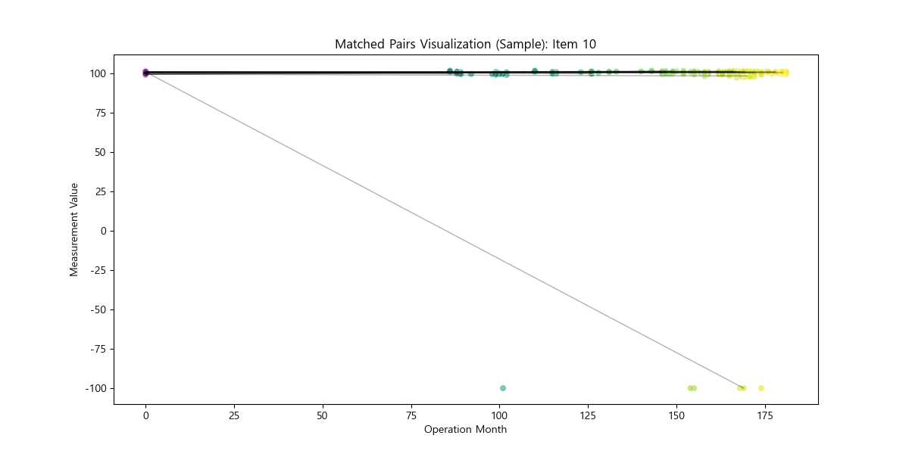 |

---

## 3. 결론 및 제언

### 3.1 종합 해석 (Comprehensive Interpretation)
전체 27개 항목에 대한 분석 결과, 다음과 같은 경향성이 식별되었습니다.

1.  **주요 노후화 항목**: **23, 1, 2** 항목들이 시간 경과에 따라 가장 뚜렷한 변화를 보이고 있습니다.
    *   특히 **Item 23**은(는) 월평균 **-0.0335**의 변화율을 보이며, 가장 급격한 상태 변화가 관찰됩니다.
2.  **데이터 일관성**: 상위 위험 항목들의 R-squared 값이 전반적으로 높게 나타난다면, 이는 노후화가 무작위가 아닌 **예측 가능한 패턴**으로 진행됨을 의미합니다.
3.  **관리 제언**: 상기 Top-5 항목들은 향후 고장 발생의 선행 지표가 될 가능성이 높으므로, 예방 정비 시 **중점 점검 대상**으로 관리할 것을 권장합니다.

